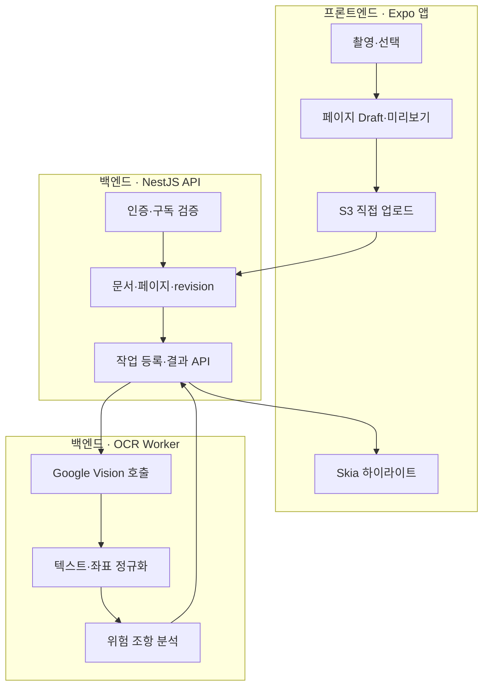
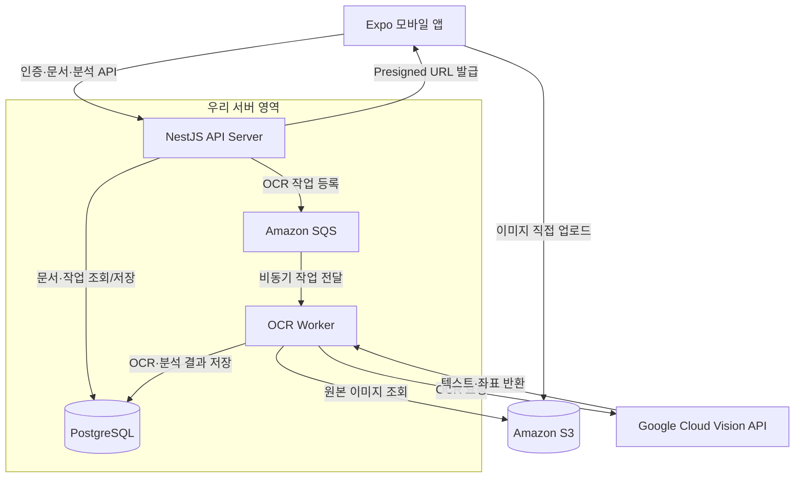
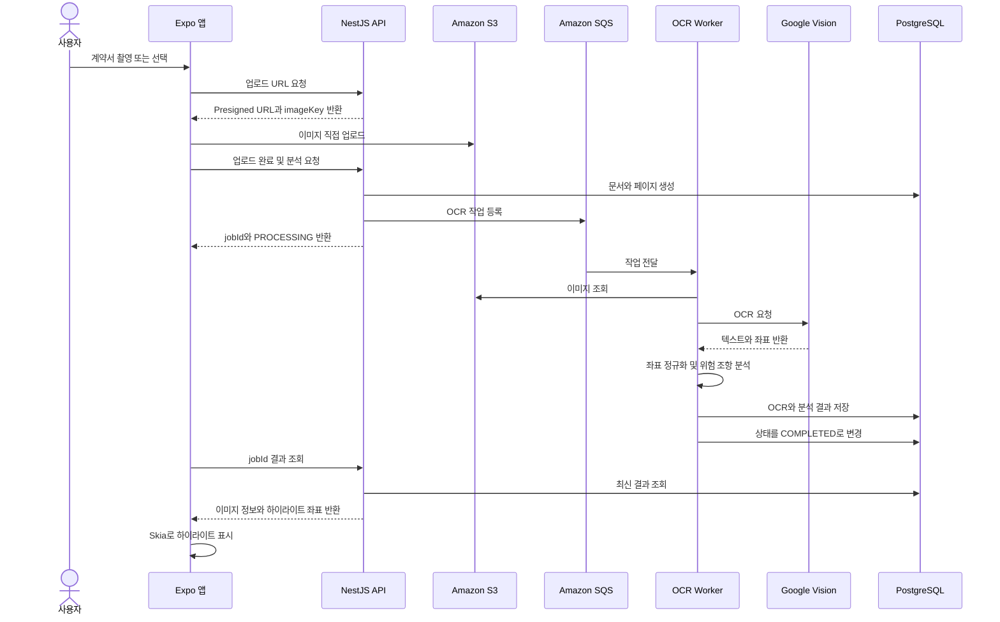
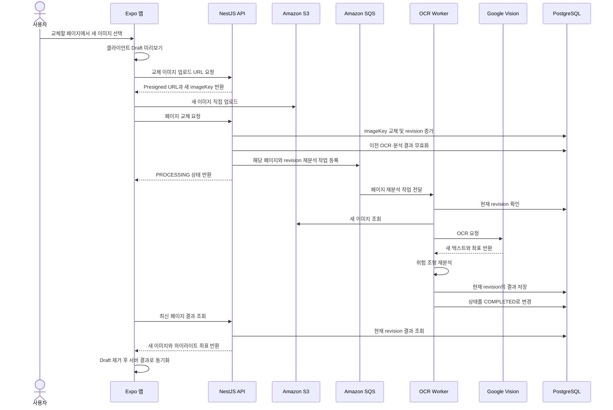
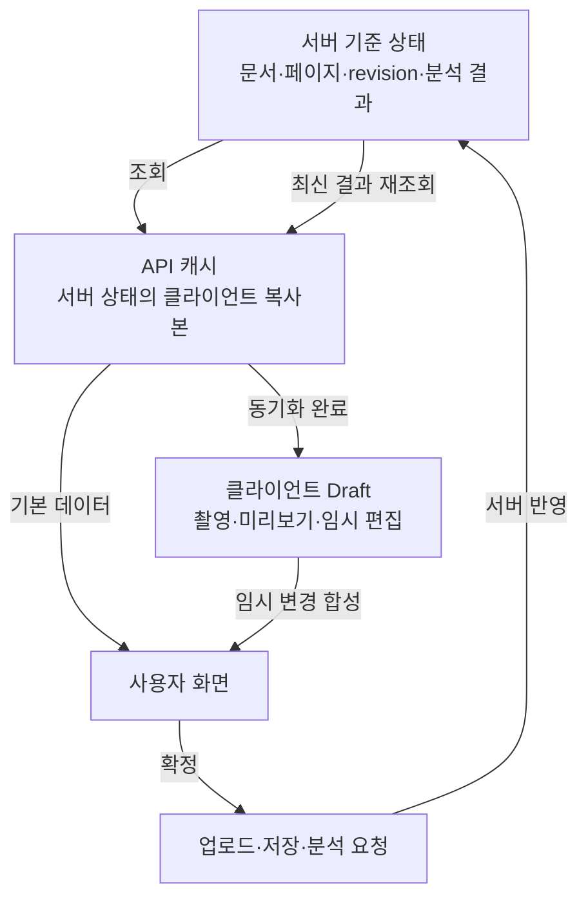

# ClauseLens

계약서나 약관을 촬영하면 OCR로 텍스트와 위치를 추출하고, 사용자에게 불리할 수 있는 조항을 이미지 위에 표시하는 모바일 앱입니다.

> ClauseLens의 분석 결과는 참고용이며 법률 자문을 대체하지 않습니다.

## 핵심 기능

1. **사진 찍기**
    - 계약서 직접 촬영
    - 갤러리 이미지 선택
    - 여러 페이지 관리 및 특정 페이지 교체

2. **분석하기**
    - Google Cloud Vision 기반 OCR
    - 텍스트와 단어·문단 좌표 추출
    - 자동 연장, 위약금, 해지 제한 등 위험 가능성이 있는 조항 분석
    - Skia를 이용한 이미지 위 하이라이트 표시
    - 분석은 사용자당 3회까지 무료 제공 예정

3. **저장하기**
    - 분석한 계약서와 결과 보관
    - 저장 및 장기 보관은 구독 기능으로 제공 예정

4. **로그인**
    - 무료 분석 횟수, 구독 상태, 저장 문서 관리

## 앱 기술 구성

| 구분 | 기술 | 역할 |
| --- | --- | --- |
| 모바일 | Expo · React Native · TypeScript | iOS와 Android 앱 개발 |
| 라우팅 | Expo Router | 화면 및 페이지 이동 관리 |
| 그래픽 | Shopify React Native Skia | OCR 좌표를 이용한 하이라이트 렌더링 |
| API 상태 | TanStack Query 예정 | 서버 데이터 조회, 캐시, 재요청 관리 |
| 클라이언트 상태 | Zustand 예정 | 촬영 중인 페이지, 선택 영역, Draft 상태 관리 |
| iOS 빌드 | Xcode · CocoaPods | iOS 네이티브 의존성 빌드 |
| Android 빌드 | Android Studio · Android SDK | Android 앱과 에뮬레이터 빌드 |

Skia 내부에는 C++ 기반 그래픽 엔진과 iOS·Android 네이티브 연결 코드가 포함되어 있습니다. 앱에서는 설치된 라이브러리의 TypeScript API를 사용하므로, 현재 범위에서는 Swift·Kotlin·C++ 코드를 직접 작성하지 않습니다.

## 프론트엔드와 백엔드의 책임

### 프론트엔드 — Expo 앱

- 카메라 촬영과 갤러리 이미지 선택
- 촬영한 페이지의 순서 변경, 삭제, 교체
- 서버에 저장하기 전 이미지와 편집 내용을 Draft로 관리
- NestJS에 S3 업로드 URL 요청
- 발급받은 Presigned URL로 이미지를 S3에 직접 업로드
- 업로드 진행률과 실패·재시도 UI 처리
- NestJS에 분석 요청을 보내고 `jobId` 수신
- 분석이 끝날 때까지 작업 상태 조회
- 서버가 반환한 텍스트, 위험도, 좌표를 화면에 표시
- 원본 이미지 크기와 화면 표시 크기의 비율을 계산
- Skia로 이미지 위에 위험 조항 하이라이트 렌더링
- 하이라이트 색상, 투명도, 선택 상태 등 화면 표현 관리
- 로그인, 무료 분석 횟수, 구독 안내 화면 제공

프론트엔드는 OCR을 직접 실행하거나 위험 조항을 판단하지 않습니다. 서버가 반환한 결과를 사용자가 확인할 수 있도록 보여주는 역할을 담당합니다.

### 백엔드 — NestJS API Server

- 사용자 인증과 접근 권한 검증
- 무료 분석 3회와 구독 상태 검증
- S3 Presigned URL과 안전한 `imageKey` 발급
- 문서, 페이지, 이미지, `revision` 관리
- 업로드 완료 여부 확인
- OCR 분석 작업을 SQS에 등록
- `jobId`와 작업 상태 관리
- 페이지 교체 시 이전 분석 결과 무효화
- 앱에 최신 문서와 분석 결과 제공
- 저장 및 장기 보관 권한 적용

### 백엔드 — OCR Worker

- SQS에서 OCR 작업 수신
- 작업의 문서, 페이지, `revision` 유효성 확인
- S3에서 분석할 이미지 조회
- Google Cloud Vision API 호출
- Vision 응답의 텍스트와 좌표를 앱에서 사용할 형식으로 정규화
- 자동 연장, 위약금, 해지 제한 등의 위험 조항 분석
- 위험도, 제목, 설명과 해당 문장의 좌표 연결
- PostgreSQL에 OCR와 분석 결과 저장
- 성공·실패 상태와 오류 정보 기록

### 책임 구분

| 기능 | 프론트엔드 | NestJS API | OCR Worker |
| --- | --- | --- | --- |
| 사진 촬영·선택 | 담당 | 하지 않음 | 하지 않음 |
| 이미지 Draft·미리보기 | 담당 | 하지 않음 | 하지 않음 |
| S3 업로드 | Presigned URL로 직접 업로드 | URL과 imageKey 발급 | 이미지 조회만 수행 |
| 문서·페이지 관리 | 화면 조작 | 최종 데이터 저장 | 하지 않음 |
| OCR 실행 | 하지 않음 | 작업 등록만 수행 | Vision을 호출해 수행 |
| 위험 조항 분석 | 하지 않음 | 결과 조회 API 제공 | 분석 수행 |
| 좌표 하이라이트 | Skia로 렌더링 | 좌표 전달 | 좌표 정규화·저장 |
| 무료 횟수·구독 검증 | 안내 화면 표시 | 최종 권한 판단 | 하지 않음 |
| 작업 상태 | 조회하고 화면에 표시 | 최종 상태 제공 | 처리 상태 갱신 |
| 기준 데이터 | 임시 Draft와 캐시 | 문서·권한의 최종 기준 | 분석 결과 생성 |

### 책임 흐름



핵심 원칙은 다음과 같습니다.

- 프론트엔드는 사용자 입력과 화면 표현을 책임집니다.
- NestJS API는 인증, 권한, 문서 상태의 최종 기준입니다.
- OCR Worker는 무거운 OCR와 위험 조항 분석을 책임집니다.
- Google Cloud Vision은 텍스트와 좌표만 추출하며 서비스 정책을 판단하지 않습니다.

## 서버 구성

서버는 실행 책임을 기준으로 두 개로 분리합니다.

### 1. API Server — NestJS

- 로그인 및 사용자 관리
- 무료 분석 횟수와 구독 상태 확인
- S3 Presigned URL 발급
- 문서, 세션, 페이지, revision 관리
- OCR 작업을 SQS에 등록
- 작업 상태와 분석 결과 조회 API 제공
- 저장 권한 및 구독 정책 처리

### 2. OCR Worker

- SQS에서 분석 작업 수신
- S3에서 원본 이미지 조회
- Google Cloud Vision API 호출
- OCR 텍스트와 좌표 정규화
- 위험 조항 분석 로직 실행
- 분석 결과를 PostgreSQL에 저장
- 작업 상태를 `PROCESSING`, `COMPLETED`, `FAILED`로 갱신

OCR Worker와 Google Cloud Vision은 서로 다른 구성입니다.

- **OCR Worker**: 우리가 개발하고 운영하는 작업 처리 서버
- **Google Cloud Vision**: Worker가 호출하는 외부 OCR 서비스

### 서버 아키텍처



NestJS API Server와 OCR Worker는 배포와 실행 책임이 분리된 두 개의 서버입니다. API Server는 모바일 요청에 빠르게 응답하고, 시간이 오래 걸리는 OCR와 분석은 Worker가 비동기로 처리합니다.

## 인프라

| 기술 | 역할 |
| --- | --- |
| Amazon S3 | 계약서 원본 이미지 저장 |
| Amazon SQS | OCR 비동기 작업 큐 |
| PostgreSQL | 사용자, 문서, 페이지, 작업 상태, 분석 결과 저장 |
| Google Cloud Vision | 이미지에서 텍스트와 좌표 추출 |
| NestJS | 모바일 앱용 API 서버 |
| OCR Worker | OCR 호출과 위험 조항 분석 수행 |

## 전체 분석 흐름



## 페이지 이미지 교체 흐름



Worker는 작업에 포함된 `revision`과 DB의 현재 `revision`을 비교합니다. 이미지가 다시 교체되어 오래된 작업이 된 경우에는 결과를 저장하지 않습니다.

## 상태 관리 원칙

서버 상태를 최종 기준으로 사용합니다.

| 클라이언트에서 관리 | 서버에서 관리 |
| --- | --- |
| 촬영 중인 이미지 미리보기 | 업로드가 완료된 이미지 정보 |
| 업로드 진행률 | 문서와 페이지의 현재 revision |
| 선택한 페이지와 화면 상태 | OCR 작업 상태 |
| 하이라이트 표시 여부와 색상 | OCR 텍스트와 원본 좌표 |
| 서버에 저장하기 전 Draft | 위험 조항 분석 결과 |
| 임시 편집 내용 | 무료 사용 횟수와 구독 상태 |

클라이언트와 서버의 상태를 물리적으로 하나로 합치지는 않습니다. 서버 데이터를 기준 상태로 두고, 클라이언트 Draft를 화면에서 합성해 보여줍니다. 저장 또는 분석 요청이 완료되면 서버의 최신 데이터로 다시 동기화합니다.

### 상태 결합 및 동기화 흐름



- 편집 중에는 `서버 상태 + 클라이언트 Draft`를 합쳐 화면에 표시합니다.
- 저장이 성공하면 서버 상태를 다시 조회하고 해당 Draft를 제거합니다.
- 충돌 여부는 `revision`으로 판단하며 최종 기준은 항상 서버입니다.

## 분석 결과 예시

Google Cloud Vision은 `자동 연장` 같은 위험 조항의 제목을 만들어 주지 않습니다. Vision은 OCR 텍스트와 위치를 반환하고, OCR Worker의 분석 단계가 위험 조항의 제목·설명·위험도를 생성합니다.

```json
{
  "jobId": "job_01",
  "status": "COMPLETED",
  "documentId": "doc_01",
  "page": {
    "pageId": "page_02",
    "revision": 3,
    "imageKey": "documents/doc_01/page_02-r3.jpg",
    "imageWidth": 2480,
    "imageHeight": 3508
  },
  "clauses": [
    {
      "id": "clause_01",
      "type": "AUTO_RENEWAL",
      "title": "자동 연장",
      "text": "별도의 의사표시가 없는 경우 본 계약은 동일한 조건으로 자동 연장됩니다.",
      "riskLevel": "HIGH",
      "boxes": [
        {
          "x": 312,
          "y": 1420,
          "width": 1710,
          "height": 108
        }
      ]
    }
  ]
}
```

Skia는 `boxes` 좌표를 화면에 표시된 이미지 크기에 맞게 변환하여 사각형을 그립니다. 하이라이트 색상과 투명도는 앱에서 자유롭게 지정할 수 있습니다.

```ts
const scaleX = displayedWidth / imageWidth;
const scaleY = displayedHeight / imageHeight;

const highlight = {
  x: box.x * scaleX,
  y: box.y * scaleY,
  width: box.width * scaleX,
  height: box.height * scaleY,
  color: "rgba(255, 80, 80, 0.35)",
};
```

## 개발 환경

- Node.js 22
- pnpm 11
- Expo SDK 57
- React Native 0.86.2
- React Native Skia 2.6.2
- Java 21
- Xcode 26
- CocoaPods 1.17
- Android Studio 및 Android SDK

## 실행 방법

```bash
pnpm install
pnpm exec expo start
```

개발 빌드 실행:

```bash
pnpm exec expo run:ios
pnpm exec expo run:android
```

환경 점검:

```bash
pnpm dlx expo-doctor
```

## 초기 개발 순서

1. 촬영 및 갤러리 이미지 선택 화면
2. 여러 페이지와 Draft 상태 관리
3. 이미지 미리보기 및 Skia 하이라이트 예제
4. NestJS Presigned URL 연동
5. 분석 작업 요청과 상태 조회
6. OCR·위험 조항 결과 표시
7. 로그인과 무료 분석 횟수 적용
8. 구독 및 문서 저장 기능 적용

## 프로젝트 상태

현재 Expo 기반 iOS·Android 개발 환경과 Skia 의존성 구성이 완료되었으며, 양쪽 시뮬레이터에서 기본 실행을 확인했습니다.
