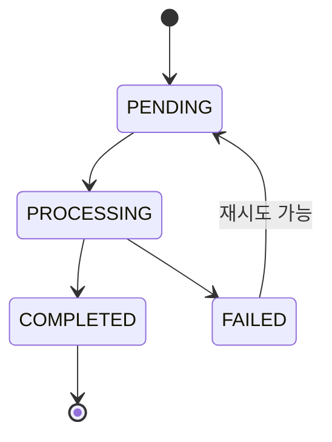

# Analysis Job Domain Guide

## 책임

- NestJS API가 분석 요청을 검증하고 SQS에 작업을 등록한다.
- OCR Worker가 작업을 수신해 Google Vision과 위험 조항 분석을 수행한다.
- 앱이 `jobId`로 상태와 결과를 조회한다.

## 상태 전이

## 작업 메시지 필수 값

- `jobId`
- `documentId`
- `pageId`
- `revision`
- `imageKey`
- 요청 추적용 `correlationId`

## 불변 조건

- NestJS 요청 처리 중 Google Vision을 직접 기다리지 않는다.
- SQS는 중복 전달될 수 있다고 가정하고 Worker를 멱등하게 구현한다.
- Worker는 저장 직전 현재 page revision을 다시 확인한다.
- 완료된 동일 job을 다시 처리해도 결과가 중복 생성되지 않는다.
- 실패 원인은 사용자용 코드와 내부 진단 정보를 분리한다.

## 관측 항목

- job 대기 시간과 처리 시간
- Vision 호출 시간과 오류 유형
- 재시도 횟수
- revision 불일치로 폐기된 작업 수
- 페이지별 성공·실패 상태

## 검증

- API가 즉시 `jobId + PROCESSING`을 반환한다.
- 중복 메시지 처리 시 결과가 하나만 유지된다.
- 오래된 revision 작업은 완료 처리되지 않는다.
- Vision 실패 시 정책에 맞게 재시도 후 FAILED로 종료된다.

