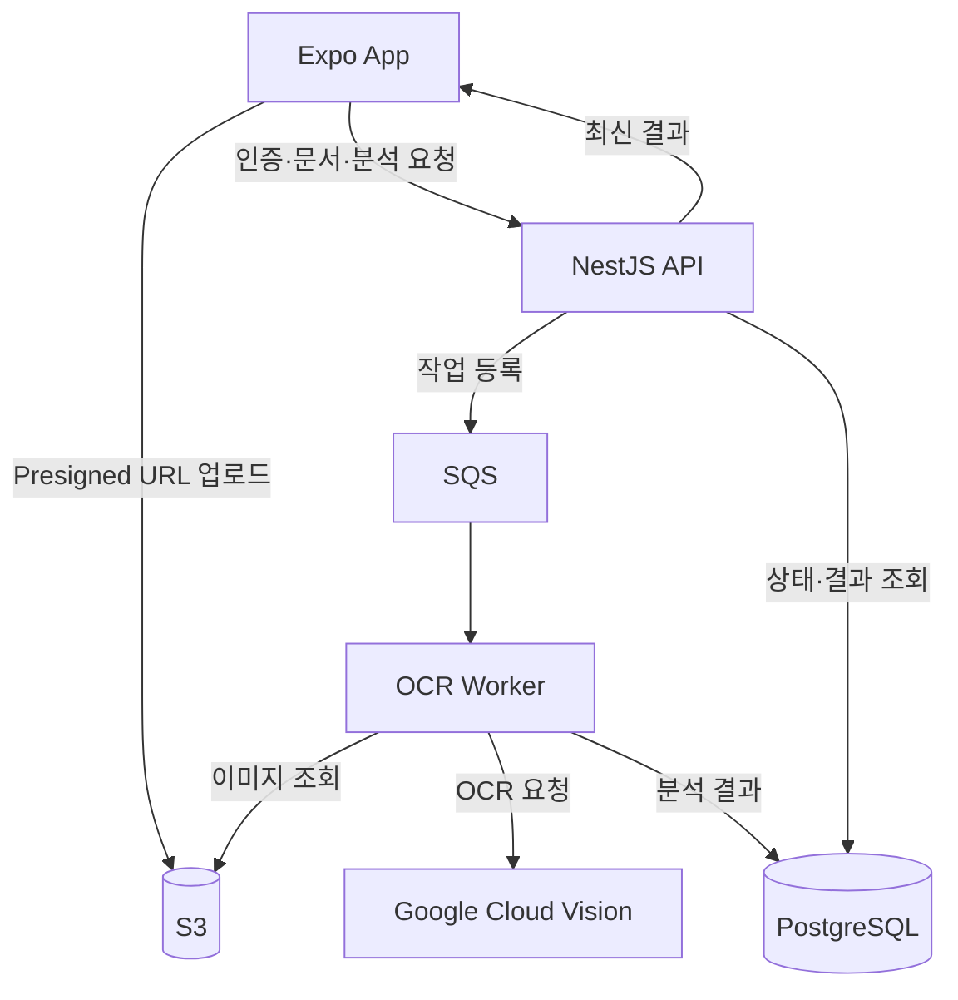

# ClauseLens Domain Map

## 목적

이 문서는 ClauseLens의 도메인 경계와 상태 소유자를 정의하며, **6개 도메인 지식 문서의 단일 인덱스**입니다.
- 도메인별 계약·불변조건(무엇이 참인가)은 같은 폴더의 도메인 파일(아래 표에서 링크).
- 사용자 기능의 실행 순서(무엇을 만드는가)는 [`intent/features/`](../intent/README.md).

## 도메인 구성

| 도메인 | 책임 | 최종 상태 소유자 |
| --- | --- | --- |
| [Auth & Entitlement](auth-entitlement.md) | 인증, 무료 분석 횟수, 구독 권한 | NestJS API |
| [Document & Page](document-page.md) | 계약서 세션, 페이지 순서, imageKey, revision | NestJS API |
| [Upload & Storage](upload-storage.md) | Presigned URL, S3 업로드, 업로드 완료 | NestJS API + S3 |
| [Analysis Job](analysis-job.md) | 작업 등록, 상태 전이, 재시도, Worker 실행 | NestJS API + OCR Worker |
| [Clause Result](clause-result.md) | OCR 텍스트, 좌표, 위험 조항, 위험도 | OCR Worker + PostgreSQL |
| [Highlight Rendering](highlight-rendering.md) | 좌표 변환, 색상, 선택 상태, Skia 렌더링 | Expo 앱 |

## 시스템 경계



## 상태 소유 원칙

- 서버 상태가 문서, 페이지, revision, 권한, OCR 결과의 최종 기준이다.
- 앱은 촬영 중 이미지, 미리보기, 업로드 진행률, 선택 상태를 Draft로 관리한다.
- 화면은 `서버 상태 + 클라이언트 Draft`를 합성할 수 있지만 저장 성공 후 서버 상태로 재동기화한다.
- Google Cloud Vision 응답은 원재료다. 서비스에서 사용하는 결과는 Worker가 정규화하고 저장한 데이터다.
- 하이라이트 색상과 투명도는 UI 상태다. 위험도와 조항 판정은 서버 결과다.

## 핵심 불변 조건

1. 모든 페이지 분석 결과는 `pageId + revision`에 귀속된다.
2. 현재 revision과 다른 Worker 결과는 저장하지 않는다.
3. 원본 OCR 좌표는 원본 이미지 픽셀 좌표로 저장한다.
4. 앱은 원본 좌표를 화면 크기에 맞춰 변환할 뿐 원본 값을 변경하지 않는다.
5. 무료 분석 횟수와 저장 권한은 클라이언트가 아닌 서버가 최종 판단한다.
6. 이미지 바이너리는 일반 API 요청 본문이 아니라 Presigned URL을 통해 S3로 직접 업로드한다.
7. NestJS API 요청에서 Google Vision을 동기 호출하지 않는다.

## 도메인 의존 방향

```text
Highlight Rendering → Clause Result → Analysis Job → Document & Page
Upload & Storage ────────────────────────────────→ Document & Page
Auth & Entitlement ─────────────→ 모든 보호 기능의 진입 조건
```

순환 의존을 만들지 않습니다. 다른 도메인의 내부 상태를 직접 수정하지 않고 공개된 계약을 통해 요청합니다.

